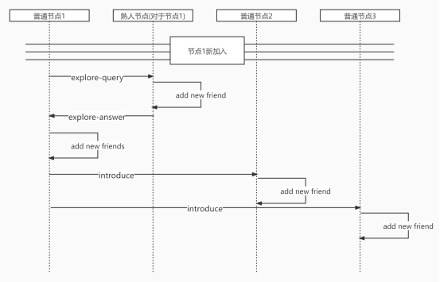
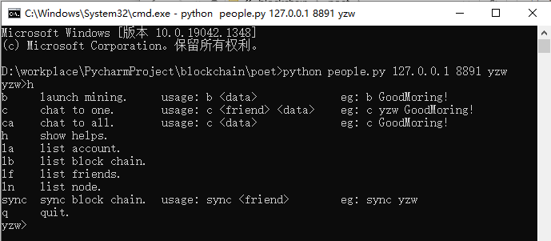
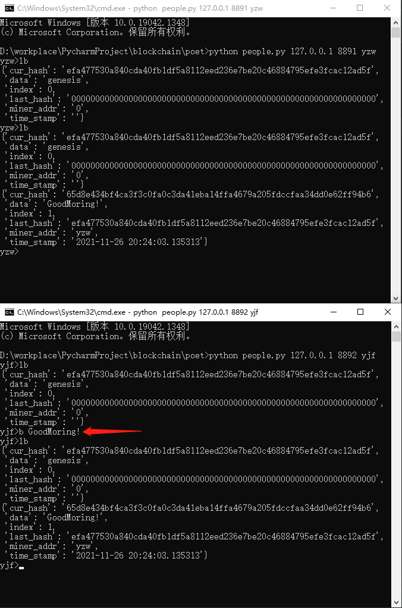

# Blockchain

​	此项目使用Python，基于UDP通信协议，在局域网搭建起P2P网络，并在此网络上实现了POET、POW、POS以及DPOS四个共识算法。

## P2P网络

​	P2P网络实现参考了项目[p2pChatRoom](https://github.com/Albert-W/p2pChatRoom)。在其基础上进行了改进，使得UDP协议能够传大于1024字节的字符串。P2P网络构建过程如下：



​	普通节点1知道熟人节点的IP:Port，则它可以通过熟人节点加入P2P网络，同时它也可以成为其他节点的熟人节点，帮助它们加入P2P网络。

​	首先，节点1向熟人节点发送“explore-query”信息，熟人节点将节点1的IP:Port加入自己的路由表，并将自己的全部路由表以消息“explore-answer”返回给节点1。

​	节点1收到路由表后，将路由信息添加进自己的路由表。对于新朋友，逐一发送“introduce”信息。收到“introduce”信息的节点，将信息来源的IP:Port添加进自己的路由表。

## 代码说明

​	由于不同算法的区块结构不同，共识过程不同，所以各个算法分开实现。每个共识算法都基于相同的P2P网络实现，都包含三个文件：people.py，block.py，config.py。

- people.py 包含Node类，负责通信和算法的实现。
- block.py 包含Account类和Block类，负责账户和区块结构。
- config.py 包含已知节点的地址，用以加入P2P网络。

​    节点间通讯的数据结构如下，根据不同的type做出不同的响应，详见代码。

```json
{
	"type": "XXXX",
    "body": {
        "XXXX": "XXXX"
    }
}
```

## 运行

### 命令行运行

```sh
// 进入某个pox文件夹，打开命令行，运行如下代码
// 先运行 `... 127.0.0.1 8891 ...`，因为config.py中的默认值为它
python people.py 127.0.0.1 8891 yzw
// 多开命令行，打开更多节点
python people.py 127.0.0.1 8892 yjf

python people.py 127.0.0.1 8893 sr

python people.py 127.0.0.1 8894 xzq
```

运行成功，则进入交互界面，如下图



输入 **h**，获取当前可用的命令列表。

### 打包区块演示

**lb** 打印区块链列表，**b data_str** 将data_str打包进区块。



