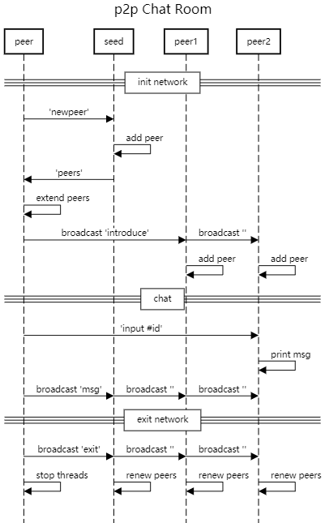

### 搭建p2p网络

[python实现去中心化 p2p 聊天室](https://zhuanlan.zhihu.com/p/82164584)




### 数据字典

#### 发信息-单播

```python
# 1.探索新朋友
{
    'type': 'explore-query',
    'body': {
        'ip': self.ip,
        'port': self.port,
        'name': self.name
	}
}
```

```python
# 2.响应探索
{
    'type': 'explore-answer',
    'body': self.friends
}
```

```python
# 3.自我介绍
{
    'type': 'introduce',
    'body': {
        'ip': self.ip,
        'port': self.port,
        'name': self.name
    }
}
```

```python
# 4.聊天 单聊
{
    'type': 'chat',
    'body': {
        'name': self.name,
        'data': params[2]
    }
}
```


#### 发消息-广播

```python
# 5.聊天 广播
{
    'type': 'broadcast',
    'body': {
        'name': self.name,
        'data': params[1]
    }
}
```

```python
# 6.退出 广播
{
    'type': 'quit',
    'body': {
        'name': self.name
    }
}
```


#### 区块链-全广播

```python
# 7.区块链 交易
{
    'type': 'block-trade',
    'body': {
        'data': params[1]
    }
}
```

```python
# 8.区块链 获得打包权利
{
    'type': 'block-miner-priority',
    'body': {
        'name': self.name
    }
}
```

```python
# 9.区块链 新区块
{
    'type': 'block-new-block',
    'body': {
        'index': 0,
        'time_stamp': '2021-11-20 09:43:06.672446',
        'data': 'genesis',
        'last_hash': '0' * 64,
        'miner_addr': 'yzw',
        'cur_hash': 'zadf'
    }
}
```

```python
# 10.区块链 同步查询
{
    'type': 'block-sync-query',
    'body': {
        'len': len(self.block_chain)
    }
}
```

```python
# 11.区块链 同步应答
{
    'type': 'block-sync-answer',
    'body': {
        'len': len(self.block_chain),
        'data': block_chain_content
    }
}
```


### console控制台

```python
tips = {
    'b': 'launch mining.    usage: b <data>    eg: b GoodMoring!',
    'c': 'chat to one.  usage: c <fname> <data> eg: c yzw GoodMoring!',
    'ca': 'chat to all. usage: c <data> eg: c GoodMoring!',
    'h': 'show helps.',
    'la': 'list account.',
    'lb': 'list block chain.',
    'lf': 'list friends.',
    'ln': 'list node.',
    'sync': 'sync block chain. usage: sync <fname>  eg: sync yzw',
    'q': 'quit.'
}
```


### 命令行运行

```sh
python people.py 127.0.0.1 8891 yzw

python people.py 127.0.0.1 8892 yjf

python people.py 127.0.0.1 8893 sr

python people.py 127.0.0.1 8894 xzq

python people.py 127.0.0.1 8895 hjs

```


