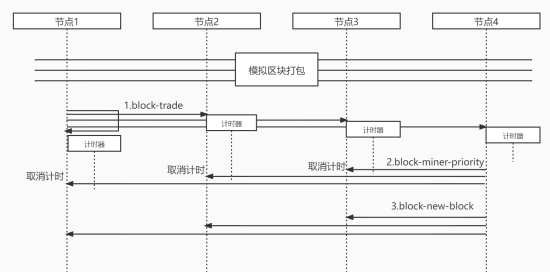

# POET算法介绍

​	POET全称 Proof of Elapsed Time，通过随机等待时间，赋予网络参与者平等胜出的机会。	其工作机制如下：每当需要产生新区块的时候，区块链网络中的每个节点都会生成一个随机的等待时间，并进入休眠状态。最先醒来的节点胜出，获取打包新区块的权利。胜出的节点将新区块广播到网络中，其他节点验证并接受新区块，同时停止自己的休眠状态。

## POET执行过程

代码模拟的POET执行过程分为三个阶段。

1. 当节点有信息需要打包时，广播“block-trade”消息。收到“block-trade”消息的节点启动计时器，等待随机的时间。

2. 最先醒来的节点获得打包区块的权利，广播“block-miner-priority”消息。收到“block-miner-priority”的节点停止自己的计时器。

3. 获取打包权的节点，生成新的区块，获取相应的奖励，并广播包含新区块信息的“block-new-block”消息。收到“block-new-block”消息的节点，验证新区块，并添加到自己的区块链中。